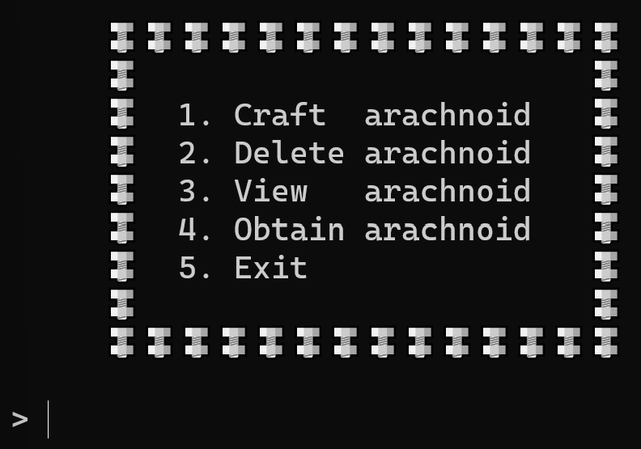
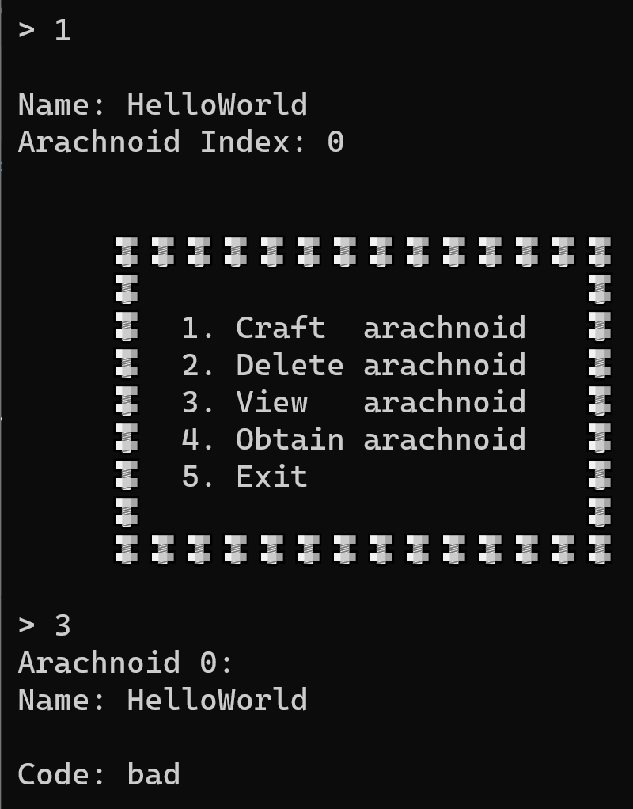
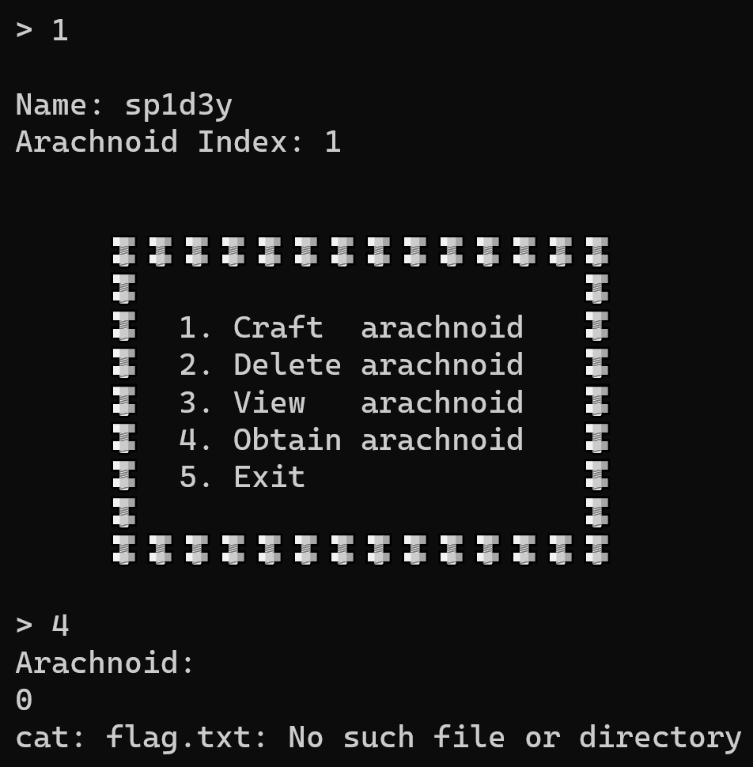

# Arachnoid Heaven

**Writeup by:** Ethann
**Category:** Pwn
**Difficulty:** Easy

We are provided with an initial IP to a server, and a binary download. Upon running the binary, we are presented with 5 options, allowing us to craft, delete, view and obtain arachnoids.



Upon selecting to create an arachnoid, we are prompted to input a name, and an arachnoid of that name, with the `Code` set automatically as `Bad`, is created. The created arachnoid can then be viewed.



## Binary Analysis

Decompiling the binary in `Ghidra`, we see that within the `obtain_arachnoid` function, a comparison is performed on the requested arachnoid.

```c
if ((iVar1 < 0) || (arachnoidCount <= iVar1)) {
    puts("Invalid Index!");
}
else {
    iVar1 = strncmp(*(char **)(arachnoids + (long)iVar1 * 0x80 + 8),"sp1d3y",6);
    if (iVar1 == 0) {
      system("cat flag.txt");
    }
    else {
      puts("Unauthorised!");
    }
}
```

The program retrieves the arachnoid at the user provided index, and compares the value at its offset pointer to the string `sp1d3y`.

Considering the `craft_arachnoid` function, we see that each arachoid consists of two pointers, the first to the arachnoid's name, as provided by the user, as well as a pointer to the code, which cannot be set directly.

```c
arachnoid_code = arachnoid_details[1];
*(void **)(arachnoids + lVar2 * 0x80) = *arachnoid_details;
*(void **)(arachnoids + lVar2 * 0x80 + 8) = arachnoid_code;
```

We must therefore overwrite the code of the created arachnoid with the string `sp1d3y` in order to satisfy the string comparison and print out the flag.

## Discovering Use-After-Free

We then inspect the dissassembly of the `delete_arachnoid` function.

```c
if (((int)uVar1 < 0) || (arachnoidCount <= (int)uVar1)) {
    puts("Invalid Index!");
}
else {
    free(*(void **)(arachnoids + lVar2));
    free(*(void **)(arachnoids + lVar2 + 8));
}
```

Here we see that despite freeing the pointers to a deleted archnoid's name and code, the pointers remain in the `arachnoids` array and so can be accessed. This opens up the program to a use-after-free vulnerability.

Due to the semantics of `malloc` and `free`, when a pointer is freed, the newly freed address is added to a last-in-first-out stack, from which a new memory address is retrieved when `malloc` is called. Therefore, as the last pointer to be freed is the pointer to the arachnoid code, we expect that when we craft a new arachnoid, the name will be stored at the pointer the previous arachnoid's code was stored at, thus allowing us to overwrite the code.

Due to the `arachnoids` array not being cleared, the original arachnoid may still be obtained, which lets us hit the comparison in `obtain_arachnoid`. Hence we can peform the following procedure:

1. Craft a new arachnoid, of any name.
2. Delete the first arachnoid.
3. Craft another new arachnoid, with the name `sp1d3y`, overwriting the first arachnoid's code.
4. Obtain the original arachnoid, located at index 0.

This should allow us to print the flag. Perfoming these steps on the local binary yields an error message, indicating that an attempt was made to print the flag file.



We can therefore connect to the provided sever IP through `Netcat` and perform the aforementioned steps, which returns the flag:

`HTB{l3t_th3_4r4chn01ds_fr3333}`
